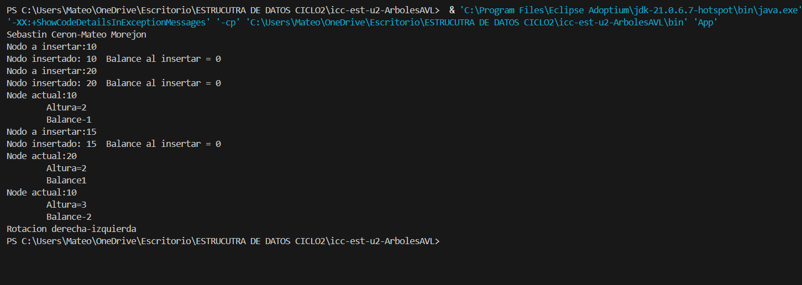

# Práctica Árbol AVL

## 📌 Información General

- **Título**: Práctica Árbol AVL
- **Asignatura**: Estructura de Datos
- **Carrera**: Computación
- **Estudiante**: Sebastián Rafael Cerón Miranda - Mateo Sebastián Morejón Delgado
- **Fecha**: 05/06/2025
- **Profesor**: Ing. Pablo Torres

---

# Ejercicios con Árboles AVL en Java

Este proyecto contiene la implementación de un **Árbol AVL**, una estructura de datos autoequilibrada. Los ejercicios están diseñados para practicar la inserción de nodos y las rotaciones en el árbol para mantener su equilibrio.

---

## 🧠 Ejercicio 01: Insertar un Nodo y Equilibrar el Árbol

En este ejercicio, se implementa un algoritmo para insertar nodos en un Árbol AVL, y luego se asegura de que el árbol esté equilibrado después de cada inserción mediante rotaciones.

### ✅ Ejemplo:
**Entrada**:  
Insertar los siguientes valores: `10, 20, 15`

**Salida esperada**:  
El árbol se equilibra después de insertar cada valor, realizando las rotaciones necesarias para mantener el equilibrio.

#### **Detalles**:
- El árbol utiliza **rotaciones** para mantener el equilibrio después de cada inserción:
  - **Rotación a la derecha** (caso de desequilibrio izquierdo-izquierdo).
  - **Rotación a la izquierda** (caso de desequilibrio derecho-derecho).
  - **Rotaciones dobles** (casos izquierdo-derecho y derecho-izquierda).

---

## 🧠 Ejercicio 02: Visualizar el Proceso de Inserción y Rotación

En este ejercicio se muestra el proceso de inserción de nodos en el Árbol AVL y cómo las rotaciones afectan el equilibrio del árbol.

### ✅ Ejemplo:
**Entrada**:  
Insertar los valores `10, 20, 15`

**Salida esperada**:  
Cada inserción y rotación se imprime para mostrar el proceso de equilibrio del árbol.

#### **Detalles**:
- Cada vez que un nodo es insertado, se calcula el **balance** del nodo.
- Si el balance es mayor que 1 o menor que -1, se realiza la rotación correspondiente.

---

### 💡 Instrucciones de Ejecución

Para ejecutar los ejercicios:

1. **Compila y ejecuta la clase `App`**.
2. La clase `App` maneja la inserción de nodos y la visualización del árbol equilibrado.

#### **Clases utilizadas**:
- **`AVLTree`**: Clase principal donde se encuentran los métodos para insertar y equilibrar el árbol AVL.
  - **Métodos**:
    - `insert()`: Inserta un nuevo nodo en el árbol y realiza las rotaciones necesarias.
    - `insertRec()`: Método recursivo para insertar un nodo y equilibrar el árbol.
    - `rotacionDerecha()`: Realiza una rotación a la derecha.
    - `rotacionIzquierda()`: Realiza una rotación a la izquierda.
    - `getBalance()`: Calcula el balance de un nodo.

- **`Node`**: Clase que representa un nodo del árbol, con atributos de valor, altura y referencias a los hijos izquierdo y derecho.

---

## 🖼️ Captura de pantalla

Aquí puedes agregar una captura de pantalla del resultado de la ejecución del programa, mostrando el árbol y los balances después de cada inserción.


---

## 💻 Créditos

Desarrollado como parte de ejercicios de práctica en la asignatura **Estructura de Datos**.

---

### Notas adicionales:
- El **Árbol AVL** mantiene el equilibrio después de cada inserción utilizando rotaciones simples o dobles.
- **Rotación a la derecha**: Se utiliza cuando hay un desequilibrio hacia la izquierda del nodo.
- **Rotación a la izquierda**: Se utiliza cuando hay un desequilibrio hacia la derecha del nodo.
- **Rotación doble**: Se utiliza cuando hay un desequilibrio en el subárbol izquierdo-derecho o derecho-izquierdo.

---

## 💡 Ejemplo de Ejecución

El siguiente código muestra cómo se pueden insertar nodos en un Árbol AVL y cómo se equilibran automáticamente:

```java
public class App {
    public static void main(String[] args) throws Exception {
        AVLTree tree = new AVLTree();
        System.out.println("Sebastin Ceron-Mateo Morejon");
        tree.insert(10);
        tree.insert(20);
        tree.insert(15);
    }
}
